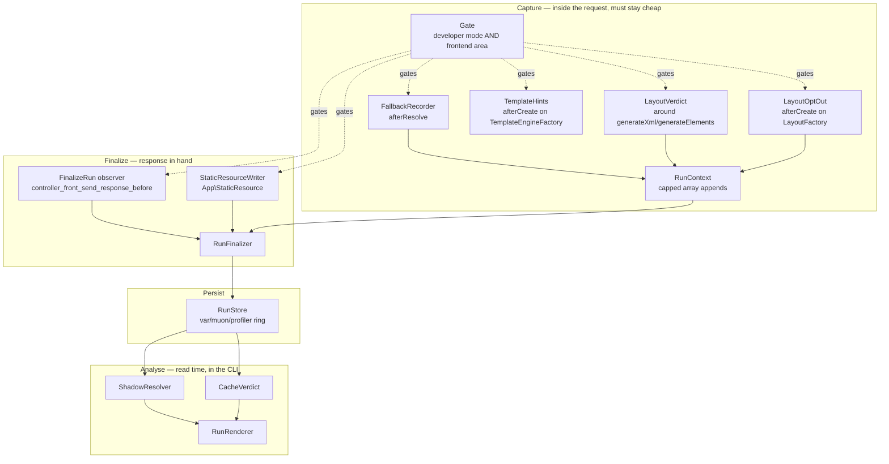

# Muon_DevProfiler — Technical Reference

Module: `Muon_DevProfiler` · Package `muon/module-dev-profiler` 1.1.1 · OSL-3.0
Requires PHP `~8.3.0 || ~8.4.0 || ~8.5.0`, Magento 2.4.9.

## Architecture

Three layers that do not know about each other. Everything expensive runs **after** the request,
reading a file.

## Interception points

| Target | Type | Class | Scope |
|---|---|---|---|
| `View\Design\FileResolution\Fallback\ResolverInterface` | after | `Plugin\View\FallbackRecorder` | frontend |
| `View\Layout` | around | `Plugin\View\LayoutVerdict` | frontend |
| `View\LayoutFactory` | after | `Plugin\View\LayoutOptOut` | frontend |
| `View\TemplateEngineFactory` | after | `Plugin\View\TemplateHints` | frontend |
| `App\StaticResource` | after | `Plugin\App\StaticResourceWriter` | **global** |

Plus one observer, in `etc/frontend/events.xml`:

| Event | Observer | Scope |
|---|---|---|
| `controller_front_send_response_before` | `Observer\FinalizeRun` | frontend |

**Why the page capture is an observer and not a plugin on `App\Http`.** It was a plugin, and that
broke the storefront outright whenever `generated/` was empty. `App\Http` is built during
bootstrap, so its plugins must be registered globally, and a global plugin is instantiated inside
`___callPlugins()`. The constructor graph reaches `StoreManagerInterface`, which `Magento_Store`
plugs — so building it made the object manager generate an interceptor mid-`___callPlugins()`,
re-entering the object manager and resetting `PluginList::$_data`. Every page then failed with
`Undefined array key "Magento\Framework\App\Http"`. With DI compiled nothing is generated and the
bug is invisible, which is exactly why it survived the first review.

`controller_front_send_response_before` is dispatched inside `launch()` after the response is
assembled, fires on cache hits too, and — being an event — is area-scoped and instantiated long
after bootstrap. **Nothing in this module may be given a `\Proxy` argument**, for the same reason:
a proxy is generated code.

## Why both `App\Http` and `App\StaticResource`

Magento has two entry points. A page is served by `App\Http`. A static asset that has not been
materialised yet is served by `App\StaticResource`, which bootstraps independently and never
reaches `App\Http`. **LESS is resolved almost exclusively in the second kind of request** — so a
profiler hooking only the first records every template a page used and none of its stylesheets.

## Shadow classification

`ShadowResolver` replays Magento's own rule rather than reimplementing it:

1. Rebuild the theme: `FlyweightFactory::create($themePath, 'frontend')`. The area is passed as an
   argument, so this works from a console command with no area code set — no emulation needed.
2. `RulePool::getRule($type)->getPatternDirs($params)` returns the ordered search directories.
   Params are rebuilt exactly as `Resolver\Simple` builds them: null keys omitted, module under
   `module_name`, `file` included.
3. Stat each directory in order. First hit is the winner; **every later hit is shadowed**.
4. Cross-check against the recorded path. A mismatch is reported as `winner-mismatch`, not
   swallowed — it means the replay diverged and the output cannot be trusted.

Anomaly values: `probe-miss` (Magento is allowed not to find it — counted, not listed),
`replay-diverged`, `winner-mismatch`, `candidates-unavailable`, `unsupported-type`.

**Path segments.** Some resolution types put a segment between the rule's directories and the
recorded file key. `html_template` is the case in practice: the key is `modal/popup.html` but the
file lives at `<module>/view/base/web/template[s]/modal/popup.html`. Magento uses both spellings —
62 modules ship `web/template/`, 5 ship `web/templates/` — so both are probed, singular first, and
a directory contributes at most one copy. Probing the wrong segment does not merely miss the file:
because the framework *did* resolve it, the miss is reported as `replay-diverged`.

## Cache verdict

| Status | Condition |
|---|---|
| `n/a` | Static-asset request — no layout, no page cache |
| `hit` | Layout never generated |
| `miss` | Generated and `isCacheable()` true |
| `uncacheable` | `isCacheable()` false — cause named where evidence supports it |
| `unknown` | Layout could not report |

`isCacheable()` is read inside `generateElements()`, the same point `PageCache`'s own layout plugin
reads it. Blocks are only offered as a cause when `hasElement()` confirms they were generated;
merged XML contains `cacheable="false"` declarations that never produced an element, and reporting
those would contradict the verdict printed beside them. When nothing accounts for it, the output
says **cause unknown** rather than inventing one.

## Stored document

`var/muon/profiler/<unixms>-<token>.json`, `schema: 1`. Only recorded facts; nothing derived.
Paths are relative to the Magento root. Keys: `schema`, `token`, `captured_at`,
`request{method,url,full_action,status,is_ajax,kind,duration_ms,memory_peak_kb}`,
`context{store_code,store_id,website_id,theme_path,theme_source}`,
`layout{generated,cacheable,handles,uncacheable_blocks[],constructor_optouts[]}`,
`fallback[]`, `queries[]`, `truncated{fallback,queries}`.

`queries[]` carries one entry per distinct statement shape, not per execution:
`{fingerprint,sample,count,total_ms,max_ms,binds,origin,is_userland,sql_varies}`. `sql_varies`
records whether the statement TEXT changed between executions — the fingerprint normalises
inlined literals away, so without it distinct reads and a repeated one are indistinguishable.

`kind` is `page` or `static` and drives the `n/a` verdict. `full_action` is `null` for requests
that never routed. `theme_source` records how the theme was learned — `observed` (the request used
it) or `configured` (recovered from store configuration afterwards, which is what happens on a
cache hit, and is reported as the weaker claim it is).

## Configuration

None. The only tunable is `ringSize` (default 50), a `di.xml` constructor argument on `RunStore`.

There is deliberately **no** `allow_production` toggle. Activation is
`State::getMode() === MODE_DEVELOPER` evaluated in code with no override path — a switch that
exists is eventually flipped, and `default` mode runs on real production sites.

## Failure behaviour

Every collector body and every I/O path is wrapped in `try/catch (\Throwable)` and logs at debug.
A profiler must never be why a page fails to render. `Gate` fails closed: an installation that
cannot report its own mode is treated as production.

`Gate` does **not** memoize a negative answer given before the area resolves. `Http::launch()` sets
the area code partway through its own execution; caching "no" from an earlier caller would silence
every collector for the rest of the request, silently. Covered by
`GateTest::testDoesNotMemoizeAnAnswerGivenBeforeTheAreaResolved`.

## v2 candidates, and what they inherit

- ~~SQL with origin and N+1 detection~~ — **built in 1.1.0.** See "SQL collector" below.
- **Block render tree** with exclusive vs inclusive time, via an around plugin on
  `AbstractBlock::toHtml()`.

## SQL collector (1.1.0)

`Plugin\Db\QueryLogger` hooks `DB\LoggerInterface::startTimer()` / `logStats()`, which Magento
calls around every statement on whichever logger the installation is configured with — so nothing
needs to replace that logger and Magento's own profiler stays off.

**Statements are aggregated in the plugin**, keyed by normalised fingerprint, not stored one per
execution: a page issuing 509 statements holds ~102 shapes. `RunContext::setMetaProvider()` resolves
the map once at assembly rather than copying it per statement.

**Three guards, in cost order.** A `busy` re-entrancy flag; an unresolved-area check that does not
cache its answer; then the memoized gate. The first is not optional — reading configuration can
itself issue a statement, and without the flag the request **hangs** rather than fails.

**Backtrace budgeting is fixed and deliberately not configurable.** A stack is walked only when a
statement exceeds 50 ms or on the 3rd execution of a shape. `Model\Sql\StatementOrigin` skips this
module, `generated/code`, framework DB **and Magento's bundled Zend DB** (`/zend-db/`, `/Zend/Db/`),
interception and the object manager. Omitting the Zend paths made every origin read
`Zend/Db/Adapter/Abstract.php` — true and useless; found by running the collector against a real
category page.

**Masking is mandatory.** `Model\Sql\ValueMasker` masks by bind key name and by value shape.
Numerics and short values are deliberately preserved: the bound id is the evidence that
distinguishes an N+1 from a duplicate, so masking it would make the finding undiagnosable.

**Analysis and thresholds are read-time.** `Model\Analysis\QueryAnalyzer` classifies each shape
against thresholds passed in from CLI flags, so one capture can be re-examined at a different
sensitivity without re-running the page. The N+1/duplicate distinction rests on whether bound
arguments were present, which a single sample cannot prove — so each finding states its basis rather
than asserting variation.
